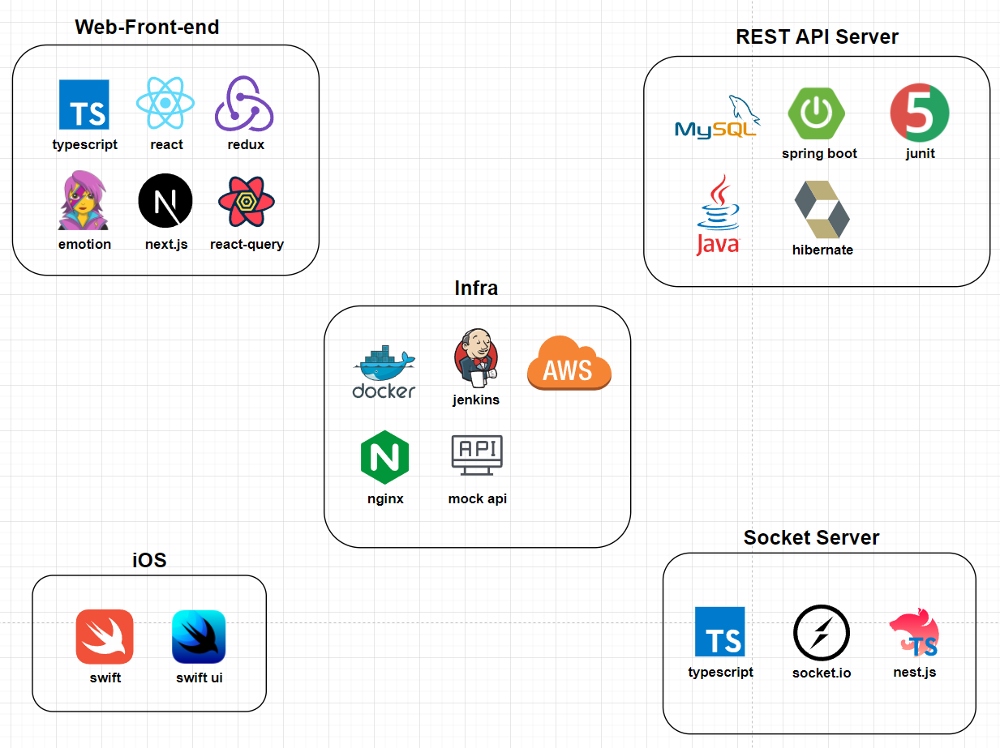
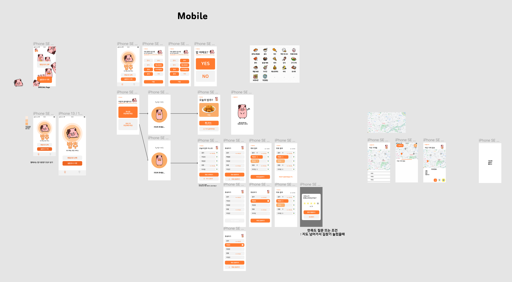

<div align="center">
  <br />
  
  <br />
  <h1>밥추</h1>
  <br />
</div>

<br />

## 목차

1. [**서비스 소개**](#1)
2. [**기술 스택**](#2)
3. [**주요 기능**](#3)
4. [**화면 설계 내용**](#4)
5. [**프로젝트 구성도**](#5)
6. [**캐릭터 디자인**](#6)
7. [**API 명세**](#7)
8. [**개발 팀 소개**](#8)
9. [**Git 규칙**](#9)

<br />

<div id="1"></div>

## 💁 서비스 소개

**밥추** 서비스는 설문을 통해 또는 랜덤으로 식사 메뉴를 선택해주는 서비스입니다. 식사 메뉴는 혼자서 결정하거나 여러 명이서 투표를 통해 선정 가능합니다. 또 현위치 주변에서 해당 메뉴를 파는 식당 목록과 경로를 제공합니다.  
**밥추** 서비스는 모바일 친화적인 웹사이트와 iOS 앱으로 이용 가능합니다.

### 서비스 기획 배경

식사 메뉴를 고르지 못하는 사람들을 대신하여 선택하기 위해 기획했습니다.

### 저장소 링크

[**🔗 백엔드 저장소**](https://lab.ssafy.com/s06-final/S06P31A303)  
[**🔗 프론트엔드 저장소**](https://lab.ssafy.com/anottrx/s06p31a303-frontend)  
[**🔗 iOS 저장소**](https://lab.ssafy.com/anottrx/s06p31a303-ios)  
[**🔗 CICD 저장소**](https://lab.ssafy.com/anottrx/s06p31a303-recommendation-service)  
[**🔗 소켓 저장소**](https://lab.ssafy.com/anottrx/s06p31a303-socket)

### 노션 링크

[**🔗 서비스 노션 링크**](https://chwimi.notion.site/0c2ceb824f3c48d2a77e595a1b3b66ad)

<br />

<div id="2"></div>

## 🛠 기술 스택

### **서비스 구성도**



<br />

<div id="3"></div>

## 💡 주요 기능

### 식사 메뉴 선정

설문 또는 랜덤으로 식사 메뉴를 선택

### 투표

투표로 여러 명이서 함께 식사 메뉴 선택 가능

### 식당 지도 제공

해당 메뉴를 파는 식당 목록과 경로 제공

<br />

<div id="4"></div>

## 💻 화면 설계 내용

| [Figma](https://www.figma.com/file/xwVM8exgzfoKCq5dmpims5/%EC%B7%A8%EB%AF%B8%ED%8C%80?node-id=0%3A1) |
| :--------------------------------------------------------------------------------------------------: |
|                                                모바일                                                |
|                                              |

<br />

<div id="5"></div>

## 📂 프로젝트 구성도

[**🔗 기능 정의서**](https://docs.google.com/spreadsheets/d/1aZ-Tk6ARGN4bDCDHEYn8KShKtQjdve7AVTqrD48GzwM)

<br />

<div id="6"></div>

## 🐷 캐릭터 디자인

|                     밥돌이 (밥추의 마스코트)                      |
| :---------------------------------------------------------------: |
|  |

<br />

<div id="7"></div>

## 📋 API 명세

[**🔗 API 명세 상세보기**](https://chwimi.notion.site/API-be1207b0c6c5411e8c4e9b11ac4d982a)

<br />

<div id="8"></div>

## 👪 개발 팀 소개

### 취미팀(就美팀)

<table>
  <tr>
    <td align="center" width="150px">
      <a href="https://github.com/anottrx" target="_blank">
        
      </a>
    </td>
    <td align="center" width="150px">
      <a href="https://github.com/eunyeong1113" target="_blank">
        
      </a>
    </td>
    <td align="center" width="150px">
      <a href="https://github.com/choymoon" target="_blank">
        
      </a>
    </td>
     <td align="center" width="150px">
      <a href="https://github.com/dgh03207" target="_blank">
        
      </a>
    </td>
    <td align="center" width="150px">
      <a href="https://github.com/DeerGum" target="_blank">
        
      </a>
    </td>
  </tr>
  <tr>
    <td align="center">
      <a href="https://github.com/anottrx" target="_blank">
        구련아<br />(Web Front-end)
      </a>
    </td>
    <td align="center">
      <a href="https://github.com/eunyeong1113" target="_blank">
        이은영<br />(Web Front-end)
      </a>
    </td>
    <td align="center">
      <a href="https://github.com/choymoon" target="_blank">
        조용문<br />(iOS)
      </a>
    </td>
    <td align="center">
      <a href="https://github.com/dgh03207" target="_blank">
        이아영<br />(Back-end)
      </a>
    </td>
    <td align="center">
      <a href="https://github.com/DeerGum" target="_blank">
        황정준<br />(Back-end)
      </a>
    </td>
  </tr>
</table>

<br />

<div id="9"></div>

## 📌 Git 규칙

### Git Convention

```
Feat : 새로운 기능을 추가할 경우
Fix : 버그를 고친 경우
Hotfix : 급하게 치명적인 버그를 고쳐야하는 경우
Design : CSS 등 사용자 UI 디자인 변경
Style : 코드 포맷 변경, 세미 콜론 누락, 코드 수정이 없는 경우
Modify : 단순한 코드 수정
Delete : 삭제한 코드 설명
Remove : 파일을 삭제하는 작업만 수행한 경우
Comment: 필요한 주석 추가 및 변경
Docs : 문서를 수정한 경우
Test : 테스트 추가, 테스트 리팩토링(프로덕션 코드 변경 X)
Chore : 빌드 태스트 업데이트, 패키지 매니저를 설정하는 경우(프로덕션 코드 변경 X)
Refactor : 코드 리팩토링 경우
Rename : 파일 혹은 폴더명을 수정하거나 옮기는 작업만인 경우
Merge : to ← from (#1)
Merge : 변경된 내용 작성
```

> Tag : 커밋 내용에 대한 설명

> 커밋 내용에 대한 설명은 간결하면서도 그 설명만 보고도 어떠한 커밋인지 추측할 수 있을 정도로 작성

### 예시

```
Feat : 로그인 API 구현
Design : 00 통계 차트 마크업 및 스타일링 구현
Refactor : 회원가입 API 코드 리팩터링
Merge : develop ← feature/login
Remove : 땡땡땡 파일 삭제
```

### 브랜치 전략

```
master : 제품으로 출시될 수 있는 브랜치
develop : 다음 출시 버전을 개발하는 브랜치
feature : 기능을 개발하는 브랜치
release : 이번 출시 버전을 준비하는 브랜치
hotfix : 출시 버전에서 발생한 버그를 수정 하는 브랜치
```

### 예시

```
master

release-1.0.0

develop

feature/login
feature/signup
```
